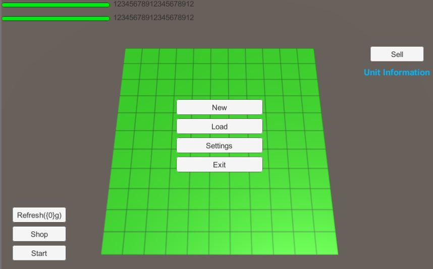
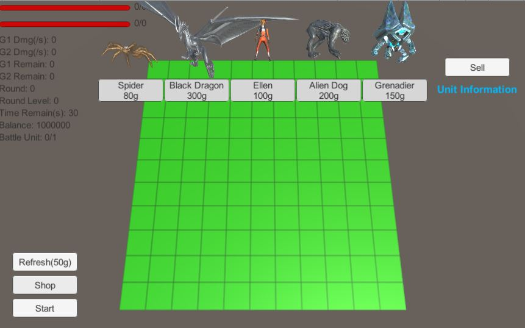

LChess

Game AutoChess Demo làm bằng Unity.

* Quái vật đối địch mỗi hiệp đấu sẽ là bản sao quái vật của người chơi bị giảm chỉ số sau đó tăng khi qua hiệp 10.
* Khi có 3 quái vật cùng loại cùng level trên sân sẽ hợp thành quái vật level cao hơn, max lv 3.
* Khi trên sân quái vật số lượng và chủng loại đạt điều kiện sẽ được tăng chỉ số, quái vật đối địch không áp dụng hiệu quả này.

### Screenshots + Explanation

Ấn New để bắt đầu.
       

Ấn Shop và mua Unit.
       

Kéo và đặt Unit từ hàng 1 lên hàng 2 hoặc hơn và ấn Start để bắt đầu trận chiến.
       

